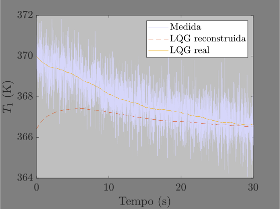
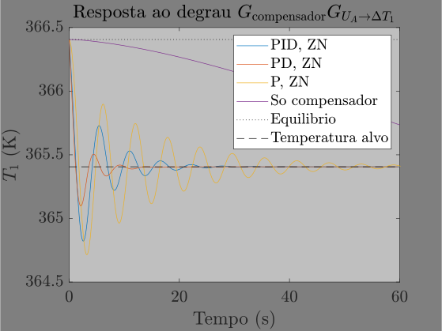

# Modelagem e controle da temperatura de um sistema de arrefecimento automotivo

O projeto modela e controla um trocador de calor, onde o calor é adicionado através de um motor, bombeado para um trocador e depois dissipado por um ventilador com área efetiva de resfriamento UA.


Resultando, após simplificações adicionais, no seguinte sistema de equações diferenciais. Observe que isso pode ser expandido para um número arbitrário de células
```math
\left\\{\begin{matrix} \frac{dT_{1}}{dt} =& \frac{\dot{m} c_{p} (T_{6}-T_{1}) + \dot{Q}_\mathrm{ger} + \frac{\dot{m}}{\rho}\Delta P{H_{2}O}}{{\rho}V_{H_{2}O,\mathrm{motor}}c_{p}} \\ \frac{dT_{n+1}}{dt} =& \frac{-0.9UA\left[\frac{T_{n}-T_{n+1}}{\ln\left(\frac{T_{n}-T_{ar}}{T_{n+1}-T_{ar}}\right)}\right]-\frac{\dot{m}}{\rho}\Delta P_{R}+\dot{m}c_{p}(T_{n}-T_{n+1})}{{\rho}V_{H_{2}O,n}c_{p}} \end{matrix}\right.
```
O código cobre vários métodos dentro do controle moderno e do controle clássico. Abaixo está um diagrama de blocos esquemático que descreve os sistemas de controle modernos e clássicos, respectivamente.


Como exemplo de controle moderno: Abaixo está o controle resultante de um controlador LQG em dados de entrada ruidosos.



Como exemplo de controle clássico: Abaixo está o controle resultante de um sistema com compensador. O sistema é inicialmente estável, mas com base no lugar das raízes um compensador foi escolhido para tornar o sistema instável com alguns ganhos, o que significa que uma sintonia PID de Ziegler Nichole era aplicável.



